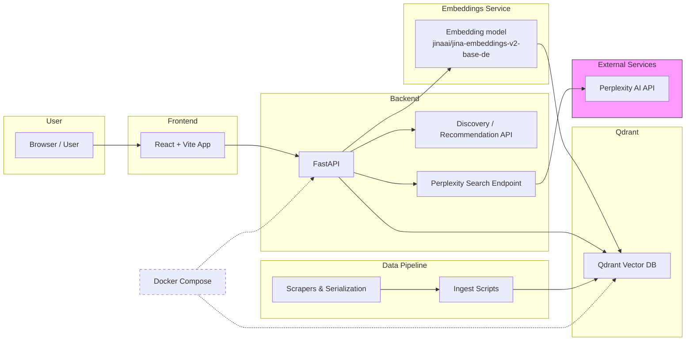

# dōTERRA Essential Oils Discovery Engine

This project is a discovery-based recommendation engine for dōTERRA essential oils, powered by [Qdrant](https://qdrant.tech). 

Inspired by the [Qdrant Food Discovery Demo](https://github.com/qdrant/demo-food-discovery), this application allows users to explore a collection of essential oils not just through traditional keyword search, but by interacting with products and receiving recommendations based on their preferences.

## 🌟 Concept

Traditional search requires you to know exactly what you are looking for. However, when exploring essential oils, you might have a vague idea of a scent profile or a benefit but want to see options and explore related products.

This demo uses a **"Discovery" paradigm**:
1. You are presented with a set of oils. Optionally you can enter a search query to rank the oils related to your query.
2. You can **Like** or **Dislike** specific products.
3. The system uses Qdrant's [Recommendation API](https://qdrant.tech/documentation/concepts/search/#recommendation-api) to find other oils that are semantically similar to your likes and dissimilar to your dislikes.
4. Contrasting with perplexity prompting based recommendations.

## 🧠 Differences from Food Discovery

While inspired by the Food Discovery demo, there are key implementation differences:

- **Modality**: The Food Discovery demo uses **image-based** search (CLIP embeddings). This project focuses on **text-based** semantic search.
- **Embeddings**: We use the `jinaai/jina-embeddings-v2-base-de` model to generate embeddings from a "serialized" text representation of each oil (including its name, sub-name, description, and lifestyle benefits). This model is finetuned to semantic understand and retrieval in German language.
- **Data**: The dataset is custom-scraped from the dōTERRA website, containing detailed product information and high-quality product images.
- **Alternative**: perplexity API as alternative search engine (baseline I failed to beat)

## 🏗️ Architecture

The project consists of three main components:
- **Backend (FastAPI)**: Connects to Qdrant, handles vectorization of search queries, and exposes discovery/recommendation endpoints.
- **Frontend (React + Vite)**: A modern, responsive UI for browsing oils and interacting with the recommendation engine.
- **Qdrant**: The vector search engine that stores oil embeddings and metadata, performing high-performance similarity searches.
- **Perplexity API**: Instead of Qdrant, prompt perplexity for recommendations.

Below is a high-level architecture diagram (Mermaid) illustrating how the pieces fit together.



## 🌐 Deployment

### Backend (HuggingFace Spaces)

The backend is deployed on **HuggingFace Spaces** as a Docker-based app:

- **Space URL**: https://aaron-test-doterra-essential-oil-recos-backend.hf.space
- **Repository**: [Aaron-test/doTERRA_essential_oil_recos_backend](https://huggingface.co/spaces/Aaron-test/doTERRA_essential_oil_recos_backend)
- **Docker Image**: Uses Python 3.11-slim with FastAPI + Uvicorn on port 7860
- **Environment Variables**: Configured in HF Spaces secrets (QDRANT_HOST, QDRANT_API_KEY, MODEL_NAME, etc.)

#### Deployment Process

1. **Build & Push**: Changes to `main` branch automatically trigger HF Spaces Docker build
2. **Cold Start**: First request after idle period (~15 mins) may take ~30-60s (model loading + initialization)
3. **Configuration**: All secrets managed via HF Spaces UI → Settings → Repository secrets

See [HF_SPACES_DEPLOYMENT.md](./HF_SPACES_DEPLOYMENT.md) for detailed setup instructions.

### Frontend (Vercel)

The frontend is deployed on **Vercel**:

- **Production URL**: https://do-terra-essential-oils-recos.vercel.app
- **Build Command**: `npm run build` (TypeScript + Vite)
- **Output Directory**: `dist`
- **Environment Variables**: `VITE_API_URL` points to the HF Spaces backend

#### Deployment Process

1. **Automatic**: Push to `main` triggers automatic deployment via Vercel GitHub integration
2. **Manual**: Run `vercel --prod` from the `frontend/` directory
3. **Configuration**: See `frontend/vercel.json` for build settings

### ⚠️ Production Deployment Note

The backend may experience **cold start delays** on the free tier when idle. This is normal for serverless/free-tier deployments.

---

## 🚀 Getting Started

### Prerequisites

- [uv](https://docs.astral.sh/uv/getting-started/installation/)
- [Node.js](https://nodejs.org/en/download)
- optional: [perplexity](https://www.perplexity.ai) API key

---

### **🚀 Quick Start (One Command)**

If you have the prerequisites installed, you can set up the entire project (installing dependencies, starting the database, and processing data) and open the app with a single command:

```bash
make run-app
```

---


### 1. Project Setup

Install all dependencies using the unified `uv` environment:

```bash
make install
```

### 2. Ingest Data

If you haven't already ingested the data into Qdrant, you can run the full pipeline or just the ingestion step:

```bash
# To run the full pipeline (scrape -> serialize -> ingest)
# See the processing/ folder for the data pipeline scripts
uv run python processing/scrape_all.py
uv run python processing/scrape_single.py
uv run python processing/serialize.py
uv run python processing/ingest_to_qdrant.py

# Or just ingestion if you already have the CSVs
make ingest
```

### 3. Run the Frontend

The frontend is also managed via the Makefile:

```bash
make dev-frontend
```

Or run both backend and frontend together:

```bash
make dev
```

The application will be available at `http://localhost:5173`.

## 🛠️ Data Pipeline

For detailed information about the data processing pipeline, see [processing/README.md](./processing/README.md).

The pipeline includes scripts for scraping, serializing, and ingesting essential oil data into Qdrant.

## Observability

- perplexity API calls are traced to https://cloud.langfuse.com/project/cmkxsm8ya020cad076m8skaub for cost and quality control

## ⚖️ Disclaimer

*This project is for demonstration purposes only. All product data and images belong to dōTERRA. This project is not affiliated with, endorsed by, or sponsored by dōTERRA.*
